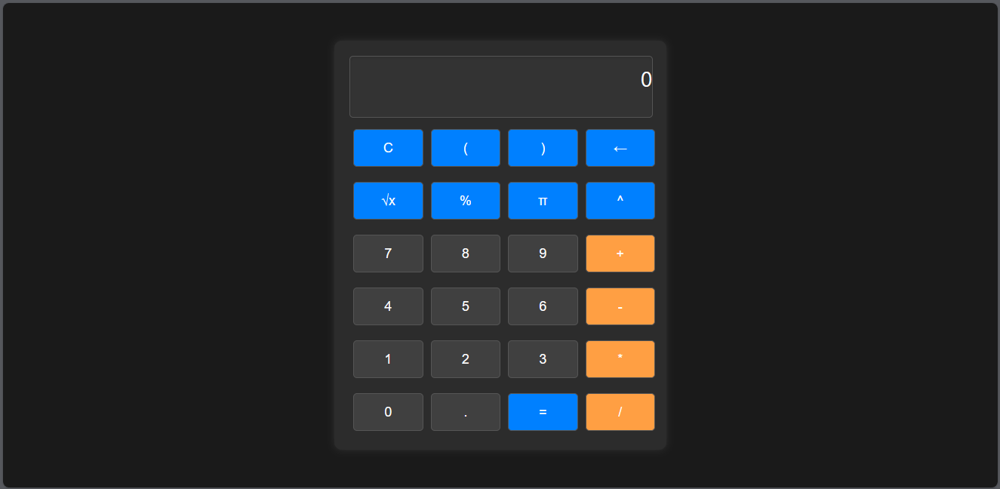

# Responsive Calculator 

This is a web application for a responsive calculator with a dark color theme. The calculator is designed to provide a user-friendly experience on various devices, allowing users to perform basic arithmetic operations, calculate square roots, percentages, and use mathematical constants.

## Features

- **Clear Display (C):** Clears the calculator display.
- **Parentheses:** Allows the use of parentheses in expressions.
- **Backspace (←):** Removes the last character from the display.
- **Square Root (√x):** Calculates the square root of the current value.
- **Percentage (%):** Converts the current value to a percentage.
- **Pi (π):** Inserts the mathematical constant Pi.
- **Exponent (^):** Raises the current value to the power of another value.
- **Numeric Buttons (0-9):** Input numeric values.
- **Operator Buttons (+, -, *, /):** Perform addition, subtraction, multiplication, and division.
- **Decimal (.) Button:** Adds a decimal point to the current value.
- **Equals (=):** Calculates the result of the expression.

## Preview



### Dark Theme

The calculator features a dark color theme for a visually appealing and comfortable user experience.

### Responsive Design

The calculator is designed to be responsive and provide an optimal viewing and interaction experience across a wide range of devices, from desktops to tablets and smartphones.

## Usage

1. Clone the repository.
   ```bash
   git clone https://github.com/IsharaParanagamaGedara/Responsive-calculator.git
   ```

2. Open the `index.html` file in a web browser to use the responsive calculator.

### File Structure

- `index.html`: The main HTML file containing the calculator structure.
- `styles.css`: The CSS file for styling the calculator interface.
- `script.js`: The JavaScript file containing the calculator logic.


Enjoy calculating on any device!

